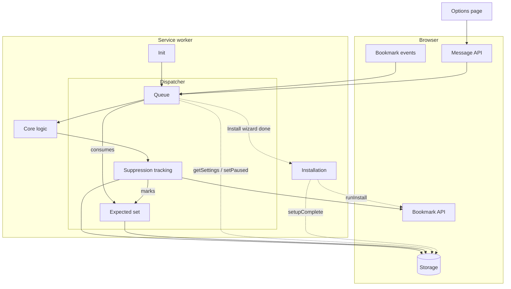

BarFly is a browser extension that takes over your bookmarks toolbar and shows you the bookmarks you've recently interacted with, LRU-cache style. You keep bookmarking and organizing things into folders as you normally do; BarFly keeps the toolbar populated with the bookmarks you've interacted with most recently.

## Motivation

I've always felt one major pain point with using bookmarks - if I bookmarked a page to read later in some specific folder, I'd never see it again unless I browsed through that specific folder. Out of sight, out of mind. I'd forget what I'd even saved, so my folders would be filled with links I wanted to read but I'd forgotten about. If I saved things to the bookmarks toolbar, they'd be visible up-front and I'd remember to use them, but the toolbar would get cluttered very quickly as it shows you the oldest items first. I was surprised to find out there's no way to keep the toolbar sorted by most recently visited or added. 

When thinking about all this, I had an idea - why not show the most recently interacted with bookmarks? Not only recently added or visited - both should count towards sorting. I realised that what I wanted was really my bookmarks bar to act as an LRU cache, and so I built BarFly to do exactly that.

BarFly splits the toolbar into two sections:

- **Pinned** - bookmarks you want visible always.
- **Dynamic** - a recency-ordered (LRU) list of bookmarks you've been visiting or adding recently, capped at a configurable capacity. Old items automatically fall off the back as new ones arrive.

The result: your toolbar always shows the bookmarks you actually need, with zero ongoing effort.

## How it works

BarFly works entirely through the browser's native bookmark APIs - there is no custom UI. For every bookmark you visit, BarFly creates a duplicate bookmark on the toolbar and manages its lifecycle. Pinned items stay untouched while the dynamic list is constantly updated on every bookmark visit and creation. The native toolbar keeps working exactly as expected (drag, middle-click, context menus, folder dropdowns, overflow). I tried to build this extension in a way that makes it feel like this feature is just part of the existing bookmarks bar. It reuses things that are already there - the native toolbar, the separator element, browser events and bookmarks API. Making this work on top of the native toolbar meant that I had to handle lots of different edge cases, but getting this right gave me the LRU-style bookmarks organization I wanted, while being as natural to use as possible.

Since BarFly takes over the bookmarks toolbar, any bookmark saved directly to the bookmarks toolbar folder automatically gets moved into a "Saved to Bookmarks Toolbar" folder under Other Bookmarks, and BarFly shows a duplicate in the dynamic section. This is to ensure that no original bookmarks ever get deleted.

### Pinned section

The section before the separator - bookmarks here stay pinned on the toolbar. To add to this, just visit a bookmark and once it appears on the toolbar, drag it behind the separator to pin it. Folders added or moved to the toolbar are automatically moved here.

### Dynamic (LRU) section

Every time you visit a bookmarked URL or create a new bookmark anywhere, BarFly adds a duplicate of it to the front of the dynamic section. The section is capped at a configurable capacity (default 10). When the cap is exceeded, the least-recently-used item drops off (the toolbar duplicate is removed; your original bookmark is untouched). Original bookmarks can't be allowed on the bar since they might get evicted, and the user might unintentionally lose data. So when an item is moved to the toolbar, a duplicate is created and the original is moved back to its original folder.

### Separator

A native `type: "separator"` bookmark node sits between the pinned and dynamic sections, giving a real visual divider using the browser's own rendering.

### Drag to pin / unpin

Dragging a dynamic bookmark past the separator into the pinned region promotes it to pinned (a copy is created in your pinned folder). Dragging a pinned item past the separator into the dynamic region demotes it. A right-click context menu item ("Pin to bar" / "Unpin from bar") does the same thing.

### Two-way sync

Renaming or changing the URL of either the original bookmark or its toolbar duplicate propagates to the other. Deleting the original removes its toolbar duplicate. Deleting a toolbar duplicate is treated as manual eviction and the original is left alone.

### Bulk imports and restoring backups

Bulk bookmark operations - importing an HTML bookmarks file, or restoring a full bookmarks backup - aren't supported while BarFly is active. These operations can recreate BarFly's own separator and toolbar duplicates as if they were brand-new bookmarks, which confuses the sync logic. Before doing either, use the "Pause event handlers" toggle in settings, or temporarily disable the extension, then re-enable once the operation is finished.

### State recovery

BarFly relies only on the bookmarks bar folder as the source of truth. Because of this, it can resume working on a fresh install if bookmarks are imported.

## Install

Requires Firefox 115+. Chrome support is planned.

[Get BarFly on addons.mozilla.org](https://addons.mozilla.org/en-US/firefox/addon/barfly/).

## Architecture

Suppression tracking is needed to prevent the extension from reacting to its own mutations. The browser fires identical events for user actions and for edits through the browser bookmarks API. The event handlers need to know if an event was fired by the extension itself in order to prevent feedback loops. So all mutations caused by the extension add a marker to the Expected Set which is then consumed in the queue when that same event shows up again and the event gets skipped. All events go through the queue to ensure state updates happen serially, to handle bursts of bookmark events (like opening a folder of bookmarks).