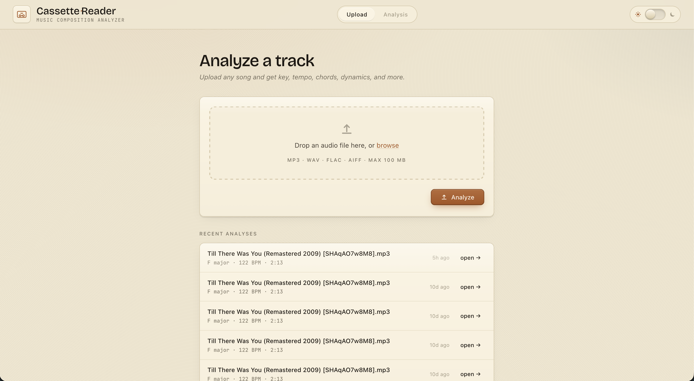
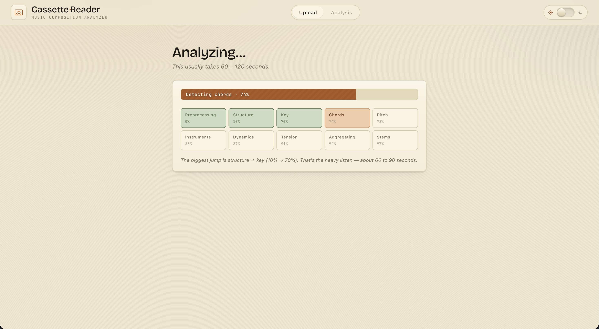
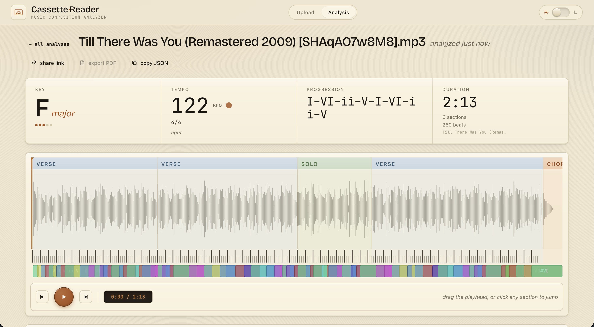
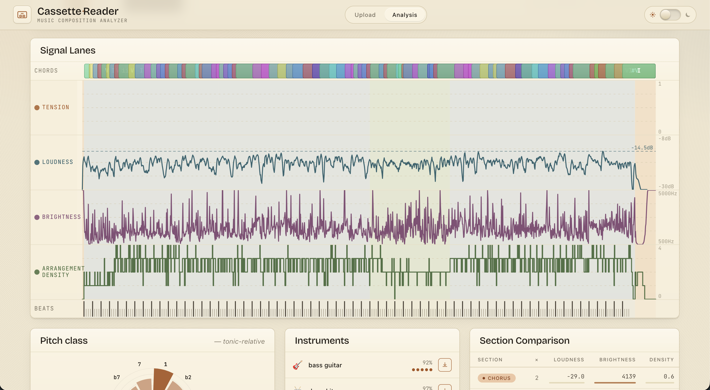
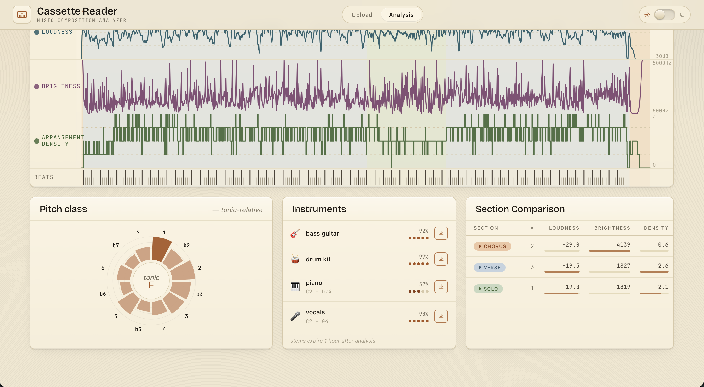

I had an idea to build out a tool for musicians and composers that would help them break a song down quickly. To understand a song, we first need to know what the overall structure is, which comes from the arrangement of different sections. So I first had to extract section information from a song. When I was looking into this problem, Claude recommended [allin1](https://github.com/mir-aidj/all-in-one) which was a single model that could provide sections, along with key, detected beats and stems. I thought this would be a great starting point and I started working on the application. 

I chose Python for the backend because it has the best ecosystem for audio analysis and ML. And to keep things simple, I used FastAPI for the HTTP handlers and to serve the frontend statically. The frontend is built as a React SPA. I used PostgreSQL for the database layer to store the analysis results. In hindsight, I could've gone with a much lighter database as I had to use Docker Compose to be able to run an isolated version of PostgreSQL just for my app. 

Getting `allin1` to work was quite hard. The libraries (Nattien) it was using underneath had changed and this broke `allin`. At first I tried different versions of Nattien and Torch, but nothing seemed to work. But Claude figured out a solution I would've never thought of. It manually patched some of those library calls to work with the version of pyTorch I had. This was the first real WTF moment I had with Claude. It wrote actual ML code to get it to work, and this is something I would never have been able to do. I would've had to know ML theory and pyTorch APIs pretty well, and even then, rewriting parts of another libraries API would've defiitely been outside my skill cap. Claude did all this in 20 minutes, and I had it write all these patches to a script file so that they could be automatically applied next time. When I was working on the Dockerfiles for this project, I created a base image with the exact versions of the libraries I needed with this patch applied on top. The actual web server and application code was added to a seperate Docker image, which built on top of the previous one.

Another interesting problem I had to deal with was with memory usage. I deployed this app on Railway, and the billing there is calculated using active usage only. This app would idle at ~1.7 GB, which seemed quite high to me for an app that wasn't being used constantly. I wanted to save costs, and to do that I had to bring down the idle RAM usage. The main issue was with Torch and the other ML libraries. These were loaded in the main process and used in a seperate thread created by FastAPI's BackgroundTasks. I looked for ways to offload unused libraries but apparently it isn't possible for complex libraries like Torch. My fix was to move all the imports into the analyis pipeline, run that in a seperate process handled by ProcessPool instead of a thread, and to terminate that process after the analysis had completed. Only the main web server process ran during idle, taking up ~300 MB of RAM. The memory usage would only go up to 1.7 GB when an analysis job was actually running. The tradeoff here is that this approach adds about 5-10 seconds to each analysis because it has to import all those libraries but since the job was already taking ~2 minutes, I was okay with waiting a little longer. This approach would be terrible if I was actually serving real users because each job reimports all the libraries, and I'd need multiple processes to handle jobs parallelly. Then, I'd just have to eat the higher idle RAM costs. But because this was just a test deployment and I knew I'd only get one job every now and then, my fix worked well and I could just leave the app up for anyone to test without worrying about crossing my 5$ Railway limit.

I moved on from this project onto CohereMix, because the data I was able to get wasn't going to be very useful to musicians. Section detection and labelling was off most of the time. It would label so many sections 'Solo'. The key detection was correct, but what about songs where the key changes? Beat detection was actually solid. The signal lanes had useful metrics such as loudness, but then I realized they weren't that helpful unless compared to another track. That line of thinking eventually led to the next iteration of this, CohereMix, which is a reference track mix comparision app.

